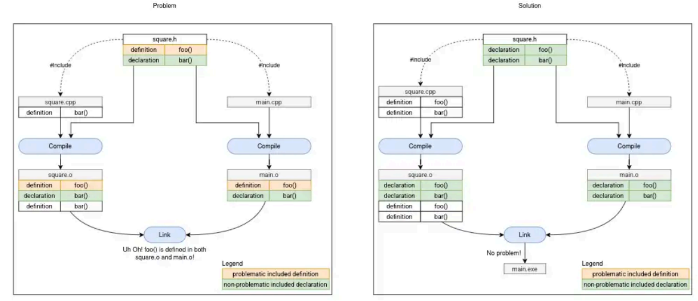

## Chapter-1: basics
### Comments 
comments should be used in for three things *library*, *program* or a *function*, these comments are typically on the top of file or top of the function

a good comment should describe the purpose of the thing, this gives a reader a good idea of what can be expected from the code without reading it 

one example of a bad comments can be 

    // Set sight range to 0
    sight = 0;
here we can see thet the comment is useless because the code itself is self descriptive 

Exaample of a good comment will be

    // The player just drank a potion of blindness and can not see anything
    sight = 0;
this tells the purpose of assigning 0 to the sight variable 

A good comment can also be something which describes a thing which may be not obvious to the others 

    // We need to multiply quantity by 2 here because they are bought in pairs
    cost = quantity * 2 * storePrice;
the above snippit of code might confuse someone as to why we are multiplying by 2 and they can't determin the purpose of this without reading some other part of code, but the comment clearly states the reason

if you have to write comment to describe how your code is doing it chances are you need to rewrite it to be more self descriptive

*so in conclusions good comments describes what it is doing and sometimes why is it doing*

---
### Variable assignment and initialization

this is a common knowledge that assignment operator = can be used to assign a value to an variable

    int var1;
    var1 = 5 // assign the value 5 to varable var1
by default the = operator copies the value at its right side the the variable at its left side. This is called **copy assignment**

although we can write the two step expression above into a single expression like 
``` int var1 = 5; ```

In C++ this is discouraged for initialization due to being less effecient than other methods and should be used for, as the name suggest, assigning a new value to the variable. C++ has multiple type of method for initialization
- default initialization : ``` int var1; // no initializer var1 contains garbage```
- copy initialization : ``` int var1 = 5; // value of 5 is assigned ```
- direct initialization : ``` int var1 ( 5 ); ```
- list initialization : ``` int var1 { 5 };```

List intialization also called **uniform initialization** or **brace initialization** introduced in c++11 is the most preferred way for initializaiton in modern C++ and the reason for that is
- copy initialization can be confused with copy assignment
- direct initialization can be confused as function call
- works in almost all cases, behaves consistently, and has an unambiguous syntax
- list initialization doesn't allow narrow conversion ```int var { 3.5 } // will give error```
- list-initialization also provides a way to initialize objects with a list of values

it is a good practice to always initialise variables to avoid undefined behaviour, hence you can use

    int x {} // x is intialized to 0

aside from this initializer list can be used to initialie using an variable or expression like `int x {y}` or `int x { (2 + 3) - 7 * 2 }`

if you have some unused variables then the compiler will give you warning to remove this warning without disabling warnings C++17 introduced ```[[maybe_unused]]``` 

    [[maybe_unused]] int var1;

---

### Intro to iostream: cout, cin
iostream is part of the C++ standard library that deals with input output realted operations

**std::cout** : it stands for character out, it is one of the most used predefined variables and is used to print something to the console.
```std::cout << "hello " << "world";```

std::cout is buffered meaning when we try to output something to screen it doesn't get immediately sent to the output device, instead it is stored in a memory region called buffer which is periodically flushed. flused in this context means that the buffer is emptied and all the content of buffer are sent to the output device in a batch

**std::cin** : stands for character in it is used to input from user
```std::cin >> x >> y;```

when we enter some data via cin then that data is added to the end of buffer with the \n newline character, the >> operator than removes the data from front of buffer and put its value into the variable on the right side

characters like white space, tab, dot, newline are discarded from front of buffered


**std::endl** : it outputs a newline character and also forces a buffer flush
using \n is far more efficient than using std::endl. it is inefficent as it forces a buffer flush whereas \n is just a newline character and doesn't do anything else

    #include <iostream>  // for std::cout and std::cin

    int main()
    {
        std::cout << "Enter a number: "; 
        int x{};  
        std::cin >> x;
        std::cout << "You entered " << x << '\n';

        return 0;
    }
try to run the program with multiple values to understand std::cin and biffer 
- h
- 3.2
- -3
- hello
- 123ab
- ab123
- 5b6
- numbers larger than 3 billion

---

### Literals and operators
Literals are also called literal constant these are values which we assign to variables like "hello world" is a string literal and 8 is an integera literal

Operators are symbols which hold special meaning and operators are applied to operators are used with operands to perform an operations like
var1 + var2 is in operation where var1 and var2 are operand and + is operator

**Chained operators**

operators can be chained together such that result of one operator can be used as input of another operator for example 2 * 3 + 3 have two operator, the operator* will produce a result 6 which can be then used as input in 6 + 3 which will give output 9

the number of operands an operator requires is called operator's arity in C++ operators are of 4 types of arities

1. unary (+, -, ++, --)
2. binary (+, -, /)
3. ternary (?:)
4. nullary (throw)

**Retrun values and side effect**

most operator in C++ just use their operands to compute a return value which is result of that operation, 
but there are also operators which doesn't produce any return value or result instead it has some other observable effect this phenomenon is called **side effect** 

there are also operators which does have a return value while also having a side effect like the assignment operator

x = 5; 

this assigns value of 5 to variable x meaning it have a side effect of assigning a value but this also returns x

meaning we can do something like 

    int x, y;
    x = y = 5;
    // evaluating from right, y = 5 returns y hence x = y = 5 becomes x = y which assigns y to x and returns x

Operator<< and operator>> are also similar to operator= in sense that they also have the some side effect and they return the variable on the left side of operator, that is the exact reason why std::cout << x << y; works becuase evaluating from left std::cout << x will be executed and return std::cout which will be then used with << y resulting in operation std::cout << y, same with std::cin >>

this behaviour of having a side effecting while returning something allows us to chain operators together to write complex mathmatical equation like (4 + 3) / 2 % 7 - 8 in C++ 

*In common english language the term "side effect" has a negative connotation to it like having side effect of taking a medicine .In C++, the term "side effect" has a different meaning: it is an observable effect of an operator or function beyond producing a return value.*

---

### Facts about expression and functions
in general programming expression is non-empty sequence of variables, operators, literals and functions calls that calculate some value. The process of executing an expression is called evaluation, the resulting value is simply called result

we can use this behaviour of expression evaluating to a single result to use expressions in place of any single value

in C++ expressions can't be compiled on their own they must be part of a statement but converting an expression into statement

but an expression like 2 + 3 * 9 - 3; is getting compiled?
yes because it is not an expression it is called an expression statement, just adding a semicolon at the end of an expression converts it into statment

hence the statement that 
> An expression on its own can't be compiled in C++

is true, because `2 + 3 * 9 - 3` can't be compiled it will throw error "missing semicolon", whereas `2 + 3 * 9 - 3;` would compile but its not expressoin its an statement
. statement like these are useless because their result is not used anywhere so its evaluated and then discarded 

**Nested Functions** are functions which are defined inside another function, this is a feature in some languages like python but in C++ these functions are illegal

In C++, there are two special requirements for main():
- main() is required to return an int.
- Explicit function calls to main() are disallowed by C++ standard (C does allow main() to be called explicitly, so some C++ compilers will allow this for compatibility reasons. it is undefined behaviour).

        void foo()
        {
            main(); // may compile maybe not (compiled on my machine)
        }

        void main() // Compile error: main not allowed to have non-int return type
        {
            foo();
        }
it is a misconception that main is the first function that is executed, global variables are initialized before invoking main and if some variable is initialized using a function call than that function will be called even before main

main function also returns 0 implicitly if no return statment is provided

**unreferenced and unnamed paramteres**: sometimes there are some parameters in function which are not used in body this causes compiler to invoke a warning

    void doSometing(int count){ // warning unreferenced count
        // count was not used in body
    }

in such cases where the paramter needs to exist but is not used in body we can use unname paramters

    void doSomething(int){ // unamed parameter
    }
    void doSomething(int /*count*/){ // according to google C++ style guid
    }

this can be useful in many cases like 
- when we need to update the function body so that a paramter becomes useless, but if we remove that paramter then we have to update every call of the function as well
- or when we overload ++ -- operator we need an unnamed paramter to determin if its postfix++ or prefix++

*Define your local variables as close to their first use as reasonable. instead of defining all of them at the top*

During function declaration also known as forward declaration we can only write the function paramters types like
`void add(int, int);` although it is discouraged to do this because this doesn't tell us the name of paramters, even if we write the param names it will get ignore by the compiler so
    
    void add(int b, int a);

    // this works as names of a and b in decleration are ignored by the compiler anyways
    void add(int a, int b){ 
        std::cout << a + b;
    }

---
### Introduction to the preprocessor
preprocess if the phase before compilation where a programm called preprocessor goes through each cpp file and make various changes to the content. the preprocessor doesn't modify the original file rather changes happen to temperory files

historically preprocessor was a seperate programm but in modern compilers it is built in

when preprocessor has finished processing the result file is called **translation unit**, this translation unit is what gets compiled

most of the preprocessor tasks are simple like strips out comments, and ensures each code file ends in a newline, but the most important task is processing the #include directive

**Preprocessor directives** are instructions which starts with # symbol like `#include <iostream>` is a preprocessor directives 

Preprocessor doesn't understand C++ code it only understand the preprocessor directives and it scans the file to look for these directives

When you #include a file, the preprocessor replaces the #include directive with the contents of the included file. The included contents are then preprocessed (which may result in additional #includes being preprocessed recursively), then the rest of the file is preprocessed.

**Macro defination** : Macros in C++ are rules that define how input text is converted into replacment text, macros can be define using `#define` directive which doesn't end in semicolon (notice that all the preprocessor instructions have slightly different syntax than C++)

There are two types of macros
- object-like macros

        // All occurence of IDENTIFIER will be removed from file and replaced with nothing
        #define IDENTIFIER 

        // all the IDENTIFIER will be replaced with substitution text
        #define IDENTIFIER substitution_text'

- function-like macros

        #define SQR(s)  ((s) * (s))
        #define PRNT(a,b) \
            printf("value 1 = %d\n", a); \
            printf("value 2 = %d\n", b) ;

*macros were used in C as a way to give name to literals, this is no longer necessary as better methods are available in C++. hence best practice is to avoid macros as much as possible*

**conditional compilation preprocessor directives** : these allow you to specify under what condition something will or will not compile
`#ifdef` `#ifndef` `#endif`

- `#ifdef` allows you to check whether a directive has been difined using `#define`

- `ifndef` opposite of #ifdef directive, check whether a directive has not been defined

- `#endif` indicate the closing of #if

- `#if 0/1` always excludes/includes a block of code from compilation

.

    #include "iostream.h"
    #define PRINT_JOE

    int main()
    {
    #ifdef PRINT_JOE
        std::cout << "Joe\n"; // will be compiled
    #endif

    #ifdef PRINT_BOB
        std::cout << "Bob\n"; // will be excluded
    #endif
    
    #ifndef PRINT_BOB
        std::cout << "Bob\n"; // Bob is printed
    #endif

    #if 0 // Don't compile anything starting here
        std::cout << "Bob\n";
        std::cout << "Steve\n";
    #endif // until this point

        return 0;
    }

one thing to keep in mind is that the text substituion of macros only happens in C++ code and doesn't happen in other preprocessor commands
> there is one exception to this rule which is `#if` and `#elif`

for example : in above code PRINT_JOE should have been replaced with nothing and #ifdef PRINT_JOE should hav become #ifdef 0 but this doesn't happen due to the reason mentioned above

    #define VERSION 2

    // here we will see that #if and #elif do macro substitution
    #if VERSION == 1
        std::cout << "Version 1\n";
    #elif VERSION == 2
        std::cout << "Version 2\n";
    #else
        std::cout << "Unknown Version\n";
    #endif

**Scope of #define** : Directives are resolved before compilation, from top to bottom on a file-by-file basis.

    #include <iostream>
    void foo(){
    #define MY_NAME "Alex"
    }

    int main(){
        std::cout << "My name is: " << MY_NAME << '\n';
        return 0;
    }
the above is as same as if MY_NAME was defined at top, preprocessor doesn't understand C++ it just looks for instructions meant for it, line by line

---
### Header files
Header files are files that contain declarations of functions, classes, and other symbols. These allow us to use the #include directive to insert all the necessary declarations into other files automatically. This avoids the need to manually retype declarations in each file and makes it convenient to work with multiple .cpp files in a large project.

**Header Guards**

 Header guards are conditional compilation directives like

    #ifndef SQUARE_H // the header file name is square.h
    #define SQUARE_H // this SQUARE_H is just a name

    int getSquareSides(){
        return 4;
    }

    #endif

1. If this is the first time we’re including the header, SQUARE_H will not have been defined. Consequently, it #defines SQUARE_H and includes the contents of the file. 
2. If the header is included again into the same file, SQUARE_H will already have been defined from the first time the contents of the header were included, and the contents of the header will be ignored (thanks to the #ifndef).

*note that this step is only for a single file meaning during preprocessing of other files this process will repeat i.e. SQUARE_H will not have already beeen defined during preprocessing of those files. each .cpp file has its own translation unit*



Good practices
- A header file can end up with .h, .hpp extension or no extension at all but .h is always preffered
- C++ doesn't restrict you from defining something in header file but it is discouraged so that when we include this header in multiple files we don't end up with mutliple defination and linker errors
- We should always use header guards to prevent multiple inclusion of the same header file in a translation unit. The preferred and portable way to do this is by using **macro-based preprocessor conditionals** (also known as include guards):
Another, simpler option is to use **#pragma once**, which tells the compiler to include the file only once per compilation. This is easier to write and avoids naming collisions in macros, but it's not part of the C++ standard and is compiler-specific
- if we generally avoid defination in header then why bother with header guards? this is because for custom types like classes we actualy have to define the class and declare all of its member, so in this case we need header guards
- For your own custom headers, use `#include "myheader.h"`, which causes preprocessor to searche your project's directories first
- For C++ standard headers, use `#include <iostream>`, which searches standard system directories first.

---
## Chapter-2:
