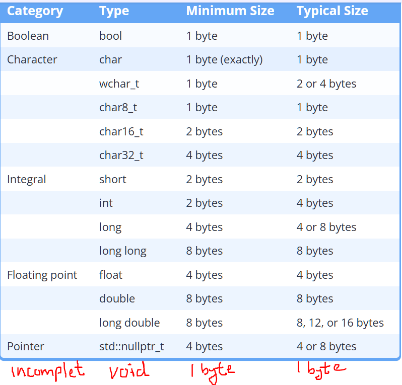
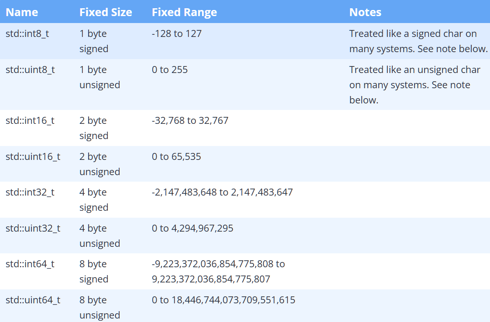
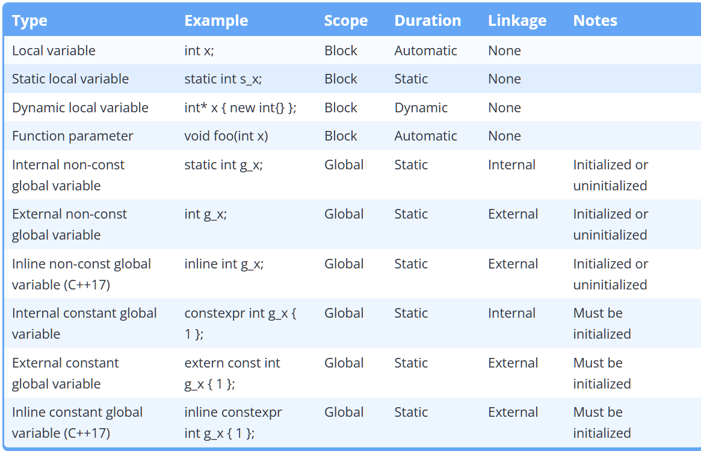
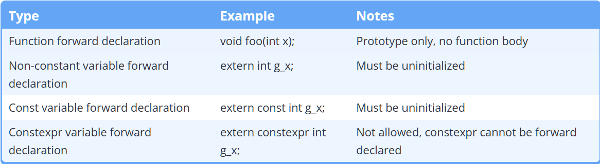

## Chapter-1: basics
### Comments 
comments should be used in for three things *library*, *program* or a *function*, these comments are typically on the top of file or top of the function

a good comment should describe the purpose of the thing, this gives a reader a good idea of what can be expected from the code without reading it 

one example of a bad comments can be 

    // Set sight range to 0
    sight = 0;
here we can see thet the comment is useless because the code itself is self descriptive 

Exaample of a good comment will be

    // The player just drank a potion of blindness and can not see anything
    sight = 0;
this tells the purpose of assigning 0 to the sight variable 

A good comment can also be something which describes a thing which may be not obvious to the others 

    // We need to multiply quantity by 2 here because they are bought in pairs
    cost = quantity * 2 * storePrice;
the above snippit of code might confuse someone as to why we are multiplying by 2 and they can't determin the purpose of this without reading some other part of code, but the comment clearly states the reason

if you have to write comment to describe how your code is doing it chances are you need to rewrite it to be more self descriptive

*so in conclusions good comments describes what it is doing and sometimes why is it doing*

---
### Variable assignment and initialization

this is a common knowledge that assignment operator = can be used to assign a value to an variable

    int var1;
    var1 = 5 // assign the value 5 to varable var1
by default the = operator copies the value at its right side the the variable at its left side. This is called **copy assignment**

although we can write the two step expression above into a single expression like 
``` int var1 = 5; ```

In C++ this is discouraged for initialization due to being less effecient than other methods and should be used for, as the name suggest, assigning a new value to the variable. C++ has multiple type of method for initialization
- default initialization : ``` int var1; // no initializer var1 contains garbage```
- copy initialization : ``` int var1 = 5; // value of 5 is assigned ```
- direct initialization : ``` int var1 ( 5 ); ```
- list initialization : ``` int var1 { 5 };```

List intialization also called **uniform initialization** or **brace initialization** introduced in c++11 is the most preferred way for initializaiton in modern C++ and the reason for that is
- copy initialization can be confused with copy assignment
- direct initialization can be confused as function call
- works in almost all cases, behaves consistently, and has an unambiguous syntax
- list initialization doesn't allow narrow conversion ```int var { 3.5 } // will give error```
- list-initialization also provides a way to initialize objects with a list of values

it is a good practice to always initialise variables to avoid undefined behaviour, hence you can use

    int x {} // x is intialized to 0

aside from this initializer list can be used to initialie using an variable or expression like `int x {y}` or `int x { (2 + 3) - 7 * 2 }`

if you have some unused variables then the compiler will give you warning to remove this warning without disabling warnings C++17 introduced ```[[maybe_unused]]``` 

    [[maybe_unused]] int var1;

a similar keyword was introduced which is `[[fallthrough]]` which can be used to indicate that break statement in a switch was not added intentionaly

    case 1:
      dosomething();
      [[fallthrough]];

---

### Intro to iostream: cout, cin
iostream is part of the C++ standard library that deals with input output realted operations

**std::cout** : it stands for character out, it is one of the most used predefined variables and is used to print something to the console.
```std::cout << "hello " << "world";```

std::cout is buffered meaning when we try to output something to screen it doesn't get immediately sent to the output device, instead it is stored in a memory region called buffer which is periodically flushed. flused in this context means that the buffer is emptied and all the content of buffer are sent to the output device in a batch

**std::cin** : stands for character in it is used to input from user
```std::cin >> x >> y;```

when we enter some data via cin then that data is added to the end of buffer with the \n newline character, the >> operator than removes the data from front of buffer and put its value into the variable on the right side

characters like white space, tab, dot, newline are discarded from front of buffered


**std::endl** : it outputs a newline character and also forces a buffer flush
using \n is far more efficient than using std::endl. it is inefficent as it forces a buffer flush whereas \n is just a newline character and doesn't do anything else

    #include <iostream>  // for std::cout and std::cin

    int main()
    {
        std::cout << "Enter a number: "; 
        int x{};  
        std::cin >> x;
        std::cout << "You entered " << x << '\n';

        return 0;
    }
try to run the program with multiple values to understand std::cin and biffer 
- h
- 3.2
- -3
- hello
- 123ab
- ab123
- 5b6
- numbers larger than 3 billion

---

### Literals and operators
Literals are also called literal constant these are values which we assign to variables like "hello world" is a string literal and 8 is an integera literal

Operators are symbols which hold special meaning and operators are applied to operators are used with operands to perform an operations like
var1 + var2 is in operation where var1 and var2 are operand and + is operator

**Chained operators**

operators can be chained together such that result of one operator can be used as input of another operator for example 2 * 3 + 3 have two operator, the operator* will produce a result 6 which can be then used as input in 6 + 3 which will give output 9

the number of operands an operator requires is called operator's arity in C++ operators are of 4 types of arities

1. unary (+, -, ++, --)
2. binary (+, -, /)
3. ternary (?:)
4. nullary (throw)

**Retrun values and side effect**

most operator in C++ just use their operands to compute a return value which is result of that operation, 
but there are also operators which doesn't produce any return value or result instead it has some other observable effect this phenomenon is called **side effect** 

there are also operators which does have a return value while also having a side effect like the assignment operator

x = 5; 

this assigns value of 5 to variable x meaning it have a side effect of assigning a value but this also returns x

meaning we can do something like 

    int x, y;
    x = y = 5;
    // evaluating from right, y = 5 returns y hence x = y = 5 becomes x = y which assigns y to x and returns x

Operator<< and operator>> are also similar to operator= in sense that they also have the some side effect and they return the variable on the left side of operator, that is the exact reason why std::cout << x << y; works becuase evaluating from left std::cout << x will be executed and return std::cout which will be then used with << y resulting in operation std::cout << y, same with std::cin >>

this behaviour of having a side effecting while returning something allows us to chain operators together to write complex mathmatical equation like (4 + 3) / 2 % 7 - 8 in C++ 

*In common english language the term "side effect" has a negative connotation to it like having side effect of taking a medicine .In C++, the term "side effect" has a different meaning: it is an observable effect of an operator or function beyond producing a return value.*

---

### Facts about expression and functions
in general programming expression is non-empty sequence of variables, operators, literals and functions calls that calculate some value. The process of executing an expression is called evaluation, the resulting value is simply called result

we can use this behaviour of expression evaluating to a single result to use expressions in place of any single value

in C++ expressions can't be compiled on their own they must be part of a statement but converting an expression into statement

but an expression like 2 + 3 * 9 - 3; is getting compiled?
yes because it is not an expression it is called an expression statement, just adding a semicolon at the end of an expression converts it into statment

hence the statement that 
> An expression on its own can't be compiled in C++

is true, because `2 + 3 * 9 - 3` can't be compiled it will throw error "missing semicolon", whereas `2 + 3 * 9 - 3;` would compile but its not expressoin its an statement
. statement like these are useless because their result is not used anywhere so its evaluated and then discarded 

**Nested Functions** are functions which are defined inside another function, this is a feature in some languages like python but in C++ these functions are illegal

In C++, there are two special requirements for main():
- main() is required to return an int.
- Explicit function calls to main() are disallowed by C++ standard (C does allow main() to be called explicitly, so some C++ compilers will allow this for compatibility reasons. it is undefined behaviour).

        void foo()
        {
            main(); // may compile maybe not (compiled on my machine)
        }

        void main() // Compile error: main not allowed to have non-int return type
        {
            foo();
        }
it is a misconception that main is the first function that is executed, global variables are initialized before invoking main and if some variable is initialized using a function call than that function will be called even before main

main function also returns 0 implicitly if no return statment is provided

**unreferenced and unnamed paramteres**: sometimes there are some parameters in function which are not used in body this causes compiler to invoke a warning

    void doSometing(int count){ // warning unreferenced count
        // count was not used in body
    }

in such cases where the paramter needs to exist but is not used in body we can use unname paramters

    void doSomething(int){ // unamed parameter
    }
    void doSomething(int /*count*/){ // according to google C++ style guid
    }

this can be useful in many cases like 
- when we need to update the function body so that a paramter becomes useless, but if we remove that paramter then we have to update every call of the function as well
- or when we overload ++ -- operator we need an unnamed paramter to determin if its postfix++ or prefix++

*Define your local variables as close to their first use as reasonable. instead of defining all of them at the top*

During function declaration also known as forward declaration we can only write the function paramters types like
`void add(int, int);` although it is discouraged to do this because this doesn't tell us the name of paramters, even if we write the param names it will get ignore by the compiler so
    
    void add(int b, int a);

    // this works as names of a and b in decleration are ignored by the compiler anyways
    void add(int a, int b){ 
        std::cout << a + b;
    }

---
### Introduction to the preprocessor
preprocess if the phase before compilation where a programm called preprocessor goes through each cpp file and make various changes to the content. the preprocessor doesn't modify the original file rather changes happen to temperory files

historically preprocessor was a seperate programm but in modern compilers it is built in

when preprocessor has finished processing the result file is called **translation unit**, this translation unit is what gets compiled

most of the preprocessor tasks are simple like strips out comments, and ensures each code file ends in a newline, but the most important task is processing the #include directive

**Preprocessor directives** are instructions which starts with # symbol like `#include <iostream>` is a preprocessor directives 

Preprocessor doesn't understand C++ code it only understand the preprocessor directives and it scans the file to look for these directives

When you #include a file, the preprocessor replaces the #include directive with the contents of the included file. The included contents are then preprocessed (which may result in additional #includes being preprocessed recursively), then the rest of the file is preprocessed.

**Macro defination** : Macros in C++ are rules that define how input text is converted into replacment text, macros can be define using `#define` directive which doesn't end in semicolon (notice that all the preprocessor instructions have slightly different syntax than C++)

There are two types of macros
- object-like macros

        // All occurence of IDENTIFIER will be removed from file and replaced with nothing
        #define IDENTIFIER 

        // all the IDENTIFIER will be replaced with substitution text
        #define IDENTIFIER substitution_text'

- function-like macros

        #define SQR(s)  ((s) * (s))
        #define PRNT(a,b) \
            printf("value 1 = %d\n", a); \
            printf("value 2 = %d\n", b) ;

*macros were used in C as a way to give name to literals, this is no longer necessary as better methods are available in C++. hence best practice is to avoid macros as much as possible*

**conditional compilation preprocessor directives** : these allow you to specify under what condition something will or will not compile
`#ifdef` `#ifndef` `#endif`

- `#ifdef` allows you to check whether a directive has been difined using `#define`

- `ifndef` opposite of #ifdef directive, check whether a directive has not been defined

- `#endif` indicate the closing of #if

- `#if 0/1` always excludes/includes a block of code from compilation

.

    #include "iostream.h"
    #define PRINT_JOE

    int main()
    {
    #ifdef PRINT_JOE
        std::cout << "Joe\n"; // will be compiled
    #endif

    #ifdef PRINT_BOB
        std::cout << "Bob\n"; // will be excluded
    #endif
    
    #ifndef PRINT_BOB
        std::cout << "Bob\n"; // Bob is printed
    #endif

    #if 0 // Don't compile anything starting here
        std::cout << "Bob\n";
        std::cout << "Steve\n";
    #endif // until this point

        return 0;
    }

one thing to keep in mind is that the text substituion of macros only happens in C++ code and doesn't happen in other preprocessor commands
> there is one exception to this rule which is `#if` and `#elif`

for example : in above code PRINT_JOE should have been replaced with nothing and #ifdef PRINT_JOE should hav become #ifdef 0 but this doesn't happen due to the reason mentioned above

    #define VERSION 2

    // here we will see that #if and #elif do macro substitution
    #if VERSION == 1
        std::cout << "Version 1\n";
    #elif VERSION == 2
        std::cout << "Version 2\n";
    #else
        std::cout << "Unknown Version\n";
    #endif

**Scope of #define** : Directives are resolved before compilation, from top to bottom on a file-by-file basis.

    #include <iostream>
    void foo(){
    #define MY_NAME "Alex"
    }

    int main(){
        std::cout << "My name is: " << MY_NAME << '\n';
        return 0;
    }
the above is as same as if MY_NAME was defined at top, preprocessor doesn't understand C++ it just looks for instructions meant for it, line by line

---
### Header files
Header files are files that contain declarations of functions, classes, and other symbols. These allow us to use the #include directive to insert all the necessary declarations into other files automatically. This avoids the need to manually retype declarations in each file and makes it convenient to work with multiple .cpp files in a large project.

**Header Guards**

 Header guards are conditional compilation directives like

    #ifndef SQUARE_H // the header file name is square.h
    #define SQUARE_H // this SQUARE_H is just a name

    int getSquareSides(){
        return 4;
    }

    #endif

1. If this is the first time we’re including the header, SQUARE_H will not have been defined. Consequently, it #defines SQUARE_H and includes the contents of the file. 
2. If the header is included again into the same file, SQUARE_H will already have been defined from the first time the contents of the header were included, and the contents of the header will be ignored (thanks to the #ifndef).

*note that this step is only for a single file meaning during preprocessing of other files this process will repeat i.e. SQUARE_H will not have already beeen defined during preprocessing of those files. each .cpp file has its own translation unit*


Good practices
- A header file can end up with .h, .hpp extension or no extension at all but .h is always preffered
- C++ doesn't restrict you from defining something in header file but it is discouraged so that when we include this header in multiple files we don't end up with mutliple defination and linker errors
- We should always use header guards to prevent multiple inclusion of the same header file in a translation unit. The preferred and portable way to do this is by using **macro-based preprocessor conditionals** (also known as include guards):
Another, simpler option is to use **#pragma once**, which tells the compiler to include the file only once per compilation. This is easier to write and avoids naming collisions in macros, but it's not part of the C++ standard and is compiler-specific
- if we generally avoid defination in header then why bother with header guards? this is because for custom types like classes we actualy have to define the class and declare all of its member, so in this case we need header guards
- For your own custom headers, use `#include "myheader.h"`, which causes preprocessor to searche your project's directories first
- For C++ standard headers, use `#include <iostream>`, which searches standard system directories first.

---
## Chapter-2: types

The reason there is minimum size and typical size is because these doesn't gaurantee a fix width of a type it can only gaurantee a minimum width. this comes from old C days where memory was limited 


mathmatical formul for this range is generally -(2^n-1) to (2^n-1)-1


**unsigned integer** overlfows and underflows is defined by the C++ standard to wrap around. how this wrapping is done is sometimes refers to modulo wrapping where the final value is moduloed by max value and remainder is stored as result

**signed integer** overlfows and underflows in C++ are not defined by the C++ standard generally in most platforms and most Compiler it wraps around to the opposite end but since its not defined by the standard it is known as undefined behaviour

--- 
### Fix width types


C++11 provides an alternate set of integer types that are guaranteed to be the same size on any architecture. Because the size of these integers is fixed, they are called fixed-width integers

The fixed-width integers actually don’t define new types -- they are just aliases for existing integral types with the desired size. For each fixed-width type, the implementation (the compiler and standard library) gets to determine which existing type is aliased. As an example, on a platform where int is 32-bits, std::int32_t will be an alias for int. On a system where int is 16-bits (and long is 32-bits), std::int32_t will be an alias for long instead.

`std::uint_fast#_t`
`std::int_fast#_t`
these two are alternative types of integers which guarantee to give the fastest integer type with width of atleast # bits (it can be more if the wider width is faster),
fastest becuase some architecture may process specific width of integer faster than other width

aside from this we generally avoid this fast and least integer types and use either treditional int or fixed-wdith integer
> int8_t, uint8_t, int_least8_t, uint_fast8_t etc typically behave like chars 

**std::size_t** is an alias for an implementation-defined unsigned integral type. In other words, the compiler decides if std::size_t is an unsigned int, an unsigned long, an unsigned long long, etc…

in C++ by default floating point literals like `5.9` etc are of type double for floating point lietrals of float type you have to write `5.9f `

 ---
 ### Other types
**Boolean** in C++ boolean is stored as either number 1 or 0 to indicate true or false, and by default std::cin for boolean only take numbers as input

    bool x;
    bool a {1}    // ok
    bool y { 3 }; // error narrowing conversion not allowed
    bool z = 3;   // ok, copy initialization implicitly converts
    std::cin>>x   // lets say input is "true" or 'h'
    std::cout<<x  // 0 is output becuase t or h is character and cin failed resulting x to be init as 0

if we want std::cin to take true or false as input and std::cout to print true or false we can use io manipulators like <br>
`std::cout << std::boolalpha`<br>
`std::cin >> std::boolalpha`

**char** : single characters taking character input is a little bit tricky

as we know how std::cin is buffered and skips tabs and spaces so 

    int main()    {
        std::cout << "Input a keyboard character: "; // assume the user enters "a b" (without quotes)

        char ch{};
        std::cin >> ch; // extracts a, leaves " b\n" in stream
        std::cout << "You entered: " << ch << '\n';

        std::cin >> ch; // skips leading whitespace (the space), extracts b, leaves "\n" in stream
        std::cout << "You entered: " << ch << '\n';

        return 0;
    }
as we know above code won't even ask for input second time becuase buffer will be filled with a b so first it will assign a then skip white space to assign b

to take space as input we can use `std::cin.get()`, this can take space as input

`wchar_t`, `char8_t`, `char16_t`, and `char32_t`
are also some of char types, char#_t explicitily states the utf encoding system like char8_t is for utf-8 and char32_t is for utf-32 they can be used to support extra characters other than ASCII 

`wchar_t` on the other hand is older and was used to handle wider character and it is platform dependedent, UTF-16 on Windows, often UTF-32 on Linux, hence we should avoid it

*static_cast<datatype>() can be used to change the datatype of value, it works by taking an input and returning the input as a specified type*

---
**Type qualifier** it is a keyword that applies to a type and modify how that type behave, there are two type qualifiers in C++ **const** and **volatile**

const as we know is a type qualifiers that restricts the modification of variable, const should always be used whenever you can becuase it tells compiler that this variable will never change which can help the compiler to apply some optimization

macros can also be used to create named constant but it is discouraged becuase const is scoped whereas macros are global and may cause conflicts
> theres no need to use const in function paramter where object is passed by value becuase it is temperory

similary to const volatile tells compiler that this object's value may change, this disables some optimization<br>
volatile is rarely no need to remember it

**As-if rule**; the rule say that the compiler can modify a program however it likes in order to produce more optimized code, so long as those modfications do not affect a program's observable behaviour

**compile tile evaluation**
: allows the compiler to do work at compile time that would other wise be done ar runtine 
- constant folding: when compiler replaces expressions that have literal operands with the result of expressoin

        int x { 3 + 4 }; // 7 would be computed on compile time and 3 + 4 replaced with 7

- constant progrpogation: in this technique compiler replaces variables known to have constant values with their values. this can reduce the no. of time memory is fetched which can reduce execution time

        int x { 7 }
        std::cout << x; // x would be replaced with 7 at compile time

- Dead code elimination: compiler removes code has no effect on program's behavior
    
        int x{7};
        std::cout<<7 // x is removed 

this is the reason making anything const which can be const is good practice because it helps compiler to identify constant

---

### constexpr

**constant expression** : it is a non-empty sequence of literals, const variables, operators, and function calls all of which must be evaluateable at compile time 

things which can't be used in a constant expression
- non-const variables
- const non-integral variables, 
- return values of no-constexpr functions
- funcion paramteres
- operators new, delete, throw etc

any expression containing any of the above is runtime expression

**Constexpr** : keyword used to create variables that can be used in constant expressions, as a result contexpr variable must be initialized with a constant expression, otherwise compiler will give error 

while contexpr variables are implicity const. const variables are not implicityly constexpr (except for const integral variables with a constant expression intializer)

best practice
- any constant variable whose intializer is a constant expression whouls be declared as constexpr
- any constant variable whose initializer is not a constant expression should be declared as const
- type that are not fully compatible with constexpr. for constant object of these types either use const or pick a different type that is constexpr compatible

**constexpr function** : a fucntion that can be called in a constant expression. it must evaluate at compile time. to be eligible for compile time execution, all arguments must be constant expression

    #include <iostream>

    int max(int x, int y) // this is a non-constexpr function{
        return x > y;
    }

    constexpr int cmax(int x, int y) // this is a constexpr function{
        return x > y;
    }

    int main()
    {
        int m1 { max(5, 6) };            // ok
        const int m2 { max(5, 6) };      // ok
        constexpr int m3 { max(5, 6) };  // compile error: max(5, 6) not a constant expression

        int m4 { cmax(5, 6) };           // ok: may evaluate at compile-time or runtime
        const int m5 { cmax(5, 6) };     // ok: may evaluate at compile-time or runtime
        constexpr int m6 { cmax(5, 6) }; // okay: must evaluate at compile-time

        return 0;
    }

**constexpr if condition**
we can use this keyword with if statments if the condition is constexpr too it will help compiler to optimize away the if else condition with the statment which will execute

    int main(){
        constexpr double gravity{ 9.8 };

        if constexpr (gravity == 9.8) // now using constexpr if
            std::cout << "Gravity is normal.\n";
        else
            std::cout << "We are not on Earth.\n";

        return 0;
    }

## strings
**std::string** : alternate to c-style string and easier to work with 

as we know cin >> skips spaces and store elements in buffere seperated by spaces meaning we can't store strings with spaces using cin >> <br>
we can use `std::getline()` to read full line of test, it takes two input first is std::cin, second is the variable in which we want to store the string

std::getline(std::cin >> std::ws, name);

std::ws is input manipulator which tells cin to ignore any leading whitespace character (spaces, tabs, newlines) 
since std::ws is not preserved across call so it must be used everytime with getline()

for creating a std::string type literal instead of c-style literal we can use 's' suffix which lives in namespace std::literals::string_lieterals like `"hello"s` 

*always avoid passing string by value if possible as std::string initialization is expensive*

**std::string_view** : to address the issue with std::string being expensive to intialize, C++17 introduces string_view which provides read-only acess to and existing string without making a copy

string_view can be initialized with many different types of string

    std::string_view s1 { "Hello, world!" }; // initialize with C-style string literal

    std::string s{ "Hello, world!" };
    std::string_view s2 { s };  // initialize with std::string
   
    std::string_view s3 { s2 }; // initialize with std::string_view

although any king of string is implicitly convertable to string_view opposit is not true

we can't do <br>

    void printString(std::string str);

    std::string_view sv { "hello" };
    std::string { sv } // ok can be initialized with string_view initializer
    printString(sv); // compiler error
    printString(static_cast<std::string>(sv)) // ok

since std::string_view can't be modified, when we assign a different value to it it just start viewing a differnt string, this concept of std::string and std::string_view is related to owner vs viewer concept 

unlike std::string, std::string_view is has support for constexpr

*A std::string_view that is viewing a string that has been destroyed is sometimes called a dangling view.*

    std::string_view name { "Alex"s }; // "Alex"s creates a temporary std::string
    std::cout << name << '\n'; // undefined behavior

**view modification functions** : consider example 
std::string_view str{ "Peach" };
	std::cout << str << '\n'; // Peach

	// Remove 1 character from the left side of the view
	str.remove_prefix(1);
	std::cout << str << '\n'; // each

	// Remove 2 characters from the right side of the view
	str.remove_suffix(2);
	std::cout << str << '\n'; // ea

	str = "Peach"; // reset the view
	std::cout << str << '\n'; // peach

the two functions are member function which modifies the view of object

---

### External linkage and internal linkage
Identifiers have a property named **linkage**. linkage defines whether the decleration of the same identifier in different scope refers to the same object or fucntion

- local variables have no linkage they are local to the scope<br>
- non-const or non-static global variables have external linking by default<br>
- functions default to external linkage but can be made internal using static keyword

**Global variables** : they are generally defined at the top of file and have global scope or file scope i.e. they are acesseble from anywhere within the file. they are also called static variables as they are created with the program and destroyed with the program

unlike local variables which are uninitialized global varaibles are always zero initialized by default, local variables initial value may vary across different compiler

    int g_x; // holds 0 by defualt
    void foo(){
        int foox; // undefined value, can't say
    }

*note that even tho global variables are called static variables, variables defined by `static` keywords are different they have internal linking as well*

test1.cpp
    
    int g_x; // multiple defination error
    int g_y; // ok 

test2.cpp

    int g_x; // multiple defination error
    static int g_y; // ok internal linking, it is its own copy

an identifier with internal linking can be seen and used within a single translation unit meaning if we have two variables with same name but internal linking then it won't voilate the one defination rule both are seperate 

an identifier with external linking can be seen andused across multiple files. wait but if by default global variables are external linking then what is the need of extern?

> linking is a step after compilation. just like we have to forward declar an external linking function we also have to forward declare an external linking variable but how do you do it? writing it twice gives multiple defination errors. in this case extern can be useful as forward declaration

test1.cpp

    extern int x; // forward declaration
    print(x) // printx 5

test2.cpp

    int x = 5; // defined in another file

extern can be used with functions but is it necessary, since compiler can easly detrmine whether a function is a forward declration or defination but for variables we have to use explicity extern to tell compiler the difference

*dont use extern for defination since non-const global variable defination are implicitly extern it will give warning and may even give error*

**inline** : it is a keyword traditionally used with functions to request inline expansion instead of function call, it can either increase performance, decrease performance or don't impact anything it all depends on the context

if a function is small that the invokation time is more than the function execution time then inline will definately help but for bigger function inline may actually hinder the performance as it will expand the function everywhere and increase the executable size

an inline function can't be just declared you must provide its full defination thats why multiple defination of inline functions in different translation unit is actually valid even tho its external linked, you just have to provide identicle body to those multiple definition to avoid undefined behaviour, 

even in header file inline function must be defined thats why its valid to redifine in multiple translation unit as the header file can be included in different files 

C++ 17 introduced inline variables which are same as funtions in regards that they can be defined in multiple files but they must be identicle, they are a good alternative to extern keyword for making a cont/non-const global external linked variables becuase unlike extern where you have to declare and define it, inline variables can just be put in one header file and included everywhere




*always try to use inline for const-global external linked variables try to avoid use of non-const global variable as they can be really bad in big projects, however if you must hvae to then use inilne instead of extern*

*all these keywords like exttern, static etc are called storage class specifier meaning that specify the duration and linkage of identifiers*

### using keyword

**qualified and unqualified name**
qulified names include the associated scope like
`class.method()`, `scope::foo()`, `ptr->foo()`, `std::cout`

unqualified names don't include the associated scope like
`count`, `cycleDelay`, `totalTime`, `foo()`

the scope of using keyword behaves same as variables i.e. if it is written within a block then it only applies to that block if it written in namespace or globalspace then it applies to the whole file scope

anonymous or unnamed namespace can be used to make multiple inline objects like functoins and variables, as they have global scope

inline keyword can be used to make a named namespace a global space without affecting the linkage so that you don't have to use name::object to access variables in that namespace this can be used to test new varient of existing functions like so

    namespace V1{ // declare a normal namespace named V1
        void doSomething(){
            std::cout << "V1\n";
        }
    }

    inline namespace V2{ // declare an inline namespace named V2
        namespace{ // unnamed namespace
            void doSomething(){ // has internal linkage
                std::cout << "V2\n";
            }
        }
    }

    int main()
    {
        V1::doSomething(); // calls the V1 version of doSomething()
        V2::doSomething(); // calls the V2 version of doSomething()

        doSomething(); // calls the inline version of doSomething() (which is V2)
    }

---

